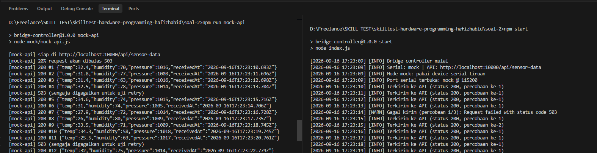

# Soal 2 — Serial Communication ke REST API

Bridge controller yang membaca data sensor dari port serial, memvalidasinya, lalu mengirim data yang valid ke REST API lewat HTTP POST.

**Stack:** Node.js, Express (untuk mock API), Axios, SerialPort

---

## Prasyarat

- **Node.js** versi 18 ke atas (disarankan LTS).
- **NPM** (bawaan Node.js).

> **Zero-Config Ready:** Aplikasi sudah dilengkapi nilai default otomatis (`SERIAL_PORT=mock`, API URL di `http://localhost:10000/api/sensor-data`). Penilai **tidak wajib** membuat file `.env` terlebih dahulu untuk menjalankan pengujian mode simulasi/mock. Cukup install dependency dan langsung jalankan!

---

## Cara Menjalankan Tanpa Hardware

Tersedia dua opsi cara menjalankan: langsung dari **root repository** (tanpa perlu `cd`) atau dari dalam **folder `soal-2`**.

### Opsi 1: Langsung dari Root Repository (Paling Cepat & Praktis)

Jika Anda baru meng-clone repository ini dan berada di direktori root:

1. **Install dependency:**
   ```bash
   npm run install:soal-2
   ```
   *(atau gunakan perintah bawaan npm: `npm --prefix soal-2 install`)*

2. **Buka dua terminal terpisah:**
   - **Terminal 1 (REST API Tiruan):**
     ```bash
     npm run mock-api
     ```
     *(atau: `npm --prefix soal-2 run mock-api`)*

   - **Terminal 2 (Bridge Controller):**
     ```bash
     npm start
     ```
     *(atau: `npm --prefix soal-2 start`)*

---

### Opsi 2: Dari dalam Folder `soal-2` (Cara Konvensional)

1. **Masuk ke folder dan install dependency:**
   ```bash
   cd soal-2
   npm install
   ```

2. *(Opsional)* Buat file environment dari template jika ingin mengubah konfigurasi:
   ```bash
   cp .env.example .env
   # Di Windows Command Prompt / PowerShell jika cp tidak tersedia:
   # copy .env.example .env
   ```

3. **Buka dua terminal:**
   - **Terminal 1 (REST API Tiruan):**
     ```bash
     npm run mock-api
     ```
   - **Terminal 2 (Bridge Controller):**
     ```bash
     npm start
     ```

---

## Perilaku Mode Simulasi (Mock)

Secara default, aplikasi berjalan dalam mode `SERIAL_PORT=mock`:
- **Pengujian Tanpa Hardware:** Device serial tiruan otomatis mengirim kombinasi data valid dan data rusak secara berkala (interval ~1 detik).
- **Uji Validasi:** Mengirim data normal, JSON terpotong, field bernilai null, field hilang, angka di luar batas wajar, dan string non-JSON.
- **Uji Reconnect Serial:** Mock serial sengaja memutus koneksi secara otomatis setelah 30 detik untuk mendemonstrasikan bahwa sistem mampu mendeteksi pemutusan, membersihkan event listener lama, dan tersambung kembali (*reconnect*) secara otomatis dalam jeda 3 detik.
- **Uji Retry REST API:** Mock API sengaja merespons dengan HTTP status 503 pada ~20% request untuk menguji keandalan mekanisme *exponential backoff retry* pada bridge controller.

---

## Cara Menjalankan Dengan Hardware Fisik

1. Salin `.env.example` ke `.env` di dalam folder `soal-2`:
   ```bash
   cp soal-2/.env.example soal-2/.env
   ```

2. Sesuaikan konfigurasi port dan baud rate di file `.env`:
   ```env
   # Contoh di Linux:
   SERIAL_PORT=/dev/ttyUSB0
   SERIAL_BAUD_RATE=115200

   # Atau contoh di Windows:
   # SERIAL_PORT=COM3
   # SERIAL_BAUD_RATE=115200
   ```

3. Untuk mendeteksi port serial yang terhubung di komputer Anda:
   ```bash
   npm --prefix soal-2 exec serialport-list
   # atau jika sudah di dalam folder soal-2:
   npx @serialport/list
   ```

4. Jalankan aplikasi seperti biasa (`npm start` atau `npm --prefix soal-2 start`).

---

## Konfigurasi Environment Variable

Semua konfigurasi dibaca dari environment variable (file `.env`) dengan fallback nilai default:

| Variabel | Default | Keterangan |
|---|---|---|
| `SERIAL_PORT` | `mock` | Path port serial (misal: `/dev/ttyUSB0` atau `COM3`), atau `mock` untuk simulasi |
| `SERIAL_BAUD_RATE` | `115200` | Baud rate komunikasi serial |
| `SERIAL_RECONNECT_DELAY` | `3000` | Jeda waktu sebelum mencoba menyambung ulang saat serial terputus (ms) |
| `API_URL` | `http://localhost:10000/api/sensor-data` | Endpoint tujuan REST API |
| `API_TIMEOUT` | `5000` | Batas waktu (timeout) tiap request HTTP (ms) |
| `API_MAX_RETRY` | `3` | Jumlah maksimal percobaan pengiriman ulang saat request gagal |
| `API_RETRY_DELAY` | `1000` | Jeda dasar antar-percobaan retry (dikalikan urutan percobaan / backoff) (ms) |

---

## Format Data & Aturan Validasi

Perangkat pengirim (mikrokontroler/sensor) mengirimkan 1 baris JSON per transaksi diakhiri karakter *newline* (`\n`):

```json
{"temp":28.5,"humidity":65,"pressure":1012}
```

### Aturan Validasi Sensor

| Field | Tipe | Wajib | Batas Wajar | Penanganan Jika Tidak Sesuai |
|---|---|---|---|---|
| `temp` | Number / Numeric String | Ya | -40.0 s/d 125.0 °C | Ditolak, dicatat di log peringatan, tidak dikirim ke API |
| `humidity` | Number / Numeric String | Ya | 0.0 s/d 100.0 % | Ditolak, dicatat di log peringatan, tidak dikirim ke API |
| `pressure` | Number / Numeric String | Ya | 300.0 s/d 1100.0 hPa | Ditolak, dicatat di log peringatan, tidak dikirim ke API |

- **String Berisi Angka:** Nilai string numerik (contoh: `"28.5"`) tetap ditoleransi dan dikonversi otomatis menjadi tipe float/integer yang valid.
- **Nilai Kosong & Rusak:** Nilai `null`, `undefined`, NaN, field yang hilang, dan string corrupt ditolak secara ketat.

---

## Payload yang Dikirim ke REST API

Data yang lolos validasi diformat dan dikirim via HTTP POST:

```http
POST /api/sensor-data HTTP/1.1
Host: localhost:10000
Content-Type: application/json
```

```json
{
  "temp": 28.5,
  "humidity": 65,
  "pressure": 1012,
  "receivedAt": "2026-09-16T19:04:06.405Z"
}
```

---

## Penanganan Kegagalan & Ketahanan Sistem (Fault Tolerance)

| Kejadian / Skenario Error | Respon & Penanganan Sistem |
|---|---|
| **JSON tidak dapat di-parse (corrupted)** | Ditangkap oleh validator, mencatat cuplikan 60 karakter awal data mentah di log `[WARN]`, lalu dibuang. Node.js tetap hidup. |
| **Field null / hilang / out-of-bounds** | Divalidasi per field, dicatat alasannya di log `[WARN]`, data dibuang, dan proses berlanjut ke baris berikutnya. |
| **Data terpotong antar-chunk serial** | Disatukan secara presisi oleh `ReadlineParser` berbasis buffer sampai karakter delimiter `\n` ditemukan. |
| **Port serial terputus / error USB** | Listener lama dibersihkan (`removeAllListeners`), port ditutup secara aman, lalu dilakukan auto-reconnect berkala setiap 3 detik. |
| **Koneksi API timeout / 5xx Server Error** | Dicoba ulang secara otomatis hingga 3 kali dengan jeda waktu meningkat (*incremental backoff*: 1000ms, 2000ms). |
| **Koneksi API menolak dengan status 4xx** | Langsung dihentikan tanpa retry, karena status 4xx mengindikasikan payload/endpoint ditolak oleh server. |
| **Unhandled Rejection / Exception** | Ditangkap oleh global process handler (`unhandledRejection` & `uncaughtException`) agar proses bridge tidak pernah crash di background. |

---

## Contoh Output Terminal

Berikut adalah cuplikan log asli saat sistem dijalankan dengan `npm run mock-api` dan `npm start`:

### 1. Terminal 1 — REST API Tiruan (`mock-api`)
```text
[mock-api] siap di http://localhost:10000/api/sensor-data
[mock-api] 20% request akan dibalas 503
[mock-api] 200 #1 {"temp":27.4,"humidity":59,"pressure":1020,"receivedAt":"2026-09-16T19:04:06.405Z"}
[mock-api] 200 #2 {"temp":26.6,"humidity":70,"pressure":1013,"receivedAt":"2026-09-16T19:04:07.420Z"}
[mock-api] 200 #3 {"temp":28.1,"humidity":75,"pressure":1018,"receivedAt":"2026-09-16T19:04:09.436Z"}
[mock-api] 503 (sengaja digagalkan untuk uji retry)
[mock-api] 200 #4 {"temp":30.4,"humidity":67,"pressure":1006,"receivedAt":"2026-09-16T19:04:10.437Z"}
```

### 2. Terminal 2 — Bridge Controller (`start`)
```text
[2026-09-16 19:04:04] [INFO] Bridge controller mulai
[2026-09-16 19:04:04] [INFO] Serial: mock | API: http://localhost:10000/api/sensor-data
[2026-09-16 19:04:04] [INFO] Mode mock: pakai device serial tiruan
[2026-09-16 19:04:04] [INFO] Port serial terbuka: mock @ 115200
[2026-09-16 19:04:05] [WARN] Data nggak valid (field humidity nggak ada atau null) -> {"temp":28.5,"pressure":1012}
[2026-09-16 19:04:06] [INFO] Terkirim ke API (status 200, percobaan ke-1)
[2026-09-16 19:04:08] [WARN] Data nggak valid (field temp nggak ada atau null) -> {"temp":null,"humidity":65,"pressure":1012}
[2026-09-16 19:04:11] [WARN] Data nggak valid (field temp di luar batas wajar: 9999) -> {"temp":9999,"humidity":65,"pressure":1012}
[2026-09-16 19:04:13] [WARN] Gagal kirim (percobaan 1/3): Request failed with status code 503
[2026-09-16 19:04:14] [INFO] Terkirim ke API (status 200, percobaan ke-2)
[2026-09-16 19:04:20] [WARN] Data nggak valid (JSON nggak bisa di-parse) -> bukan json sama sekali
[2026-09-16 19:04:34] [INFO] Statistik: {"diterima":29,"valid":17,"tidakValid":12,"terkirim":17,"gagalKirim":0}
[2026-09-16 19:04:34] [WARN] Port serial tertutup
[2026-09-16 19:04:34] [INFO] Coba sambung ulang dalam 3000 ms
[2026-09-16 19:04:37] [INFO] Mode mock: pakai device serial tiruan
[2026-09-16 19:04:37] [INFO] Port serial terbuka: mock @ 115200
```

### 3. Tangkapan Layar Pengujian


---

## Struktur Modul Kode

Kode dirancang dengan arsitektur modular (*Separation of Concerns*) sehingga tiap modul dapat diuji secara independen:

| File | Peran & Tanggung Jawab |
|---|---|
| `index.js` | Entry point utama: orchestrator event pipeline (`serial` -> `validator` -> `sender`) serta reporting statistik berkala. |
| `config.js` | Abstraksi environment variable (`dotenv`) dengan nilai default fallback yang aman. |
| `logger.js` | Formatting log terstandarisasi dengan timestamp ISO dan log levels (`INFO`, `WARN`, `ERROR`). |
| `serial.js` | Manajemen siklus koneksi serial, stream framing (`ReadlineParser`), pembersihan listener, dan auto-reconnect. |
| `validator.js` | Parsing string JSON dan validasi tipe serta batas fisis sensor (`temp`, `humidity`, `pressure`). |
| `sender.js` | HTTP client (Axios) untuk dispatch POST request dengan timeout dan retry exponential backoff. |
| `mock/mock-serial.js` | Generator data serial tiruan dan penguji pemutusan koneksi otomatis untuk mode simulasi. |
| `mock/mock-api.js` | Server REST API tiruan berbasis Express untuk memvalidasi alur pengiriman dan error 503. |
| `sample-data.txt` | Kumpulan contoh raw stream data valid, edge cases, dan corrupted payload untuk acuan pengujian. |

---

## Asumsi Desain

1. **Format Stream:** Komunikasi serial diasumsikan berformat *Newline-Delimited JSON* (NDJSON). Jika hardware target menggunakan delimiter khusus (misal `\r\n` atau null byte), cukup sesuaikan opsi parser pada `serial.js`.
2. **Karakteristik Status Code:** HTTP status 2xx menandakan data sukses diterima. Status 4xx menandakan client error/payload invalid (tidak di-retry). Status 5xx dan network timeout menandakan kegagalan sementara (*transient error*) dan akan di-retry hingga 3 kali.
3. **Karakteristik Telemetri:** Data yang diproses merupakan data telemetri real-time berkala, sehingga jika retry habis setelah server down, data lama di-drop untuk mencegah starvation data terkini.

---

## Keterbatasan & Rencana Pengembangan

Pada implementasi saat ini, data yang gagal dikirim setelah retry habis langsung dibuang agar buffer memori tidak membengkak (*out-of-memory prevention*). Jika skenario industri membutuhkan jaminan *zero-data-loss* saat server offline dalam waktu lama, solusi ideal berikutnya adalah menambahkan *persistent local queue* (misalnya SQLite / local append-only log file) yang akan di-drain ketika koneksi server pulih kembali. Analisis mendalam mengenai strategi pencegahan memory leak dan buffer queuing dibahas pada `soal-3/README-soal-3.md`.
